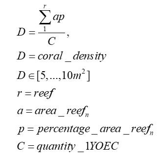

# 3.	Ecological models
## 3.1	ADRIA
### 3.1.1	Aquaculture:
Currently, ADRIA only implements aquaculture interventions.
Relevant model information:

- Model represents 5 functional groups (can be any number of species per group – not specified in model) but currently only deploys 3 of the 5 functional groups.
- Model input for intervention deployment is number of 1YOEC.
- Model assumes one 1YOEC per device.
- Reef(s) where 1YOEC are deployed can change from year to year, but this is recorded in outputs.
- Reef sites represent average cover over each functional group within a particular area; set coral density (#/m2) determines number of corals that can be put into particular area; if more space is needed, model expands to additional reefs.
- Model assumes that corals planted add to average cover.
- Heat tolerance is modelled by adding distributions representing survival probabilities over DHWs.
- Relevant settings:
    - Number of functional groups
    - Heat tolerance level of corals
    - Deployment reef(s) - ID
    - Year, quantity and frequency of 1YOEC deployment (for each year)

## 3.2	ReefMod
### 3.2.2	Aquaculture and larval slicks
ReefMod applies the same model specifications to implement aquaculture and larval slick interventions. 
Relevant model information:

-	Model represents up to 6 functional groups (can be any number of species per group – not specified in model).
-	Heat tolerance is modelled.
-	Relationship between coral density (currently used 6.8m2) and number of 1YOEC:

 

This relationship is used to calculate number of 1YOEC that need to be produced.
-	Relevant settings:
    -	Number of functional groups
    -	Heat tolerance level of corals
    -	Deployment areaDeployment site(s)/ reef(s) - ID
    - Coral density
    - Year, quantity and frequency of 1YOEC deployment (for each year)
    
## 3.3	C~scape
### 3.2.3	Aquaculture and larval slicks
C~scape applies the same model specifications to implement aquaculture and larval slick interventions as ADRIA and ReefMod.

Relevant model information:

-	Represents up to 6 coral functional groups (multiple coral species are represented by a functional group, but the exact species are can be any number of species per group – not specified in the model).
-	Model assumes all species within one functional group to be one speciescan reproduce with each other which would likely – probably overestimates reproduction ratesuccess.
-	Selection for Hheat tolerance is modelled.
-	Relationship between coral density (currently used 6.8m2 for the deployment density) and number of 1YOEC:
  
- This relationship is used to calculate number of 1YOEC that need to be produced for deployment.
-	“Undeployed” 1YOEC
-	If insufficient habitat extent is available in the selected reef at any deployment time, not all produced corals are deployed in C~scape, which can generates a sunk cost.
-	Given the dynamic nature of coral ecology, it is difficult to estimate available habitat extent ex-ante, and hence ‘produce & deploy’ (in cost model) the required number of 1YOEC that can be ‘deployed’ in C~scape.
-	While this problem exists in all ecological models, only the high spatial resolution of C~scape makes this issue visible.
- Opportunity for study:
    - Option of deployment on ‘backup’ reef
    - If amount of ‘undeployed’ corals can be estimated over time ex-post model run, cost savings could potentially be calculated (Opportunity for RRAP study)
      
-	Relevant settings:
    - Number of functional groups
    - Heat tolerance level of deployed corals
    - Deployment area per site
    - Deployment site(s)/ reef(s) - ID
    - Coral density
    - Year, quantity and frequency of 1YOEC deployment (for each year)
    
## 3.4	CoCoNet
### 3.4.1	Larval slicks
CoCoNet currently only models larval slicks due to difficulties of thermal tolerance being diluted when modelling outplanting over larger areas. Slicks have similar heat tolerance, so this isn’t so much an issue.
Relevant model information:

-	Model represents 5 functional groups (can be any number of species per group – not specified in model).
-	Key parameters regarding source-target reefs:
    - Number of larval source reefs per vessel
    - Number of larval settlements per reef (1 YOEC)
-	Model captures slicks from another reef represented in the model:
  
    - Source and target reef either chosen at random within specified ‘reef region’ or fixed to set reed IDs
    - The number of larval source reefs are set in the CoCoNet. While pre-set reef IDs can be used, the use of a decision tree is likely to generate a more general/robust result from the ensemble run:
          
        - Within some designated region, randomly select a deployment reef with coral cover below some threshold (to reduce competition).
        - Randomly select a source reef within a specified radius of the deployment reef that has coral cover above some threshold (to ensure it produces sufficient slick), then use its coral community composition and heat tolerance characteristics for the deployment.
        - Repeat for specified number of source and deployment reefs.
        - Voyage distance could be (but currently is not) calculated within CoCoNet.
          
    - Larval slick carries the heat tolerance and community composition of the original reef
      
-	Larvae are captured and settled in the same year.
-	There is no specification of how much slick is needed for X 1YOEC corals (need be accounted for in the LinkCode)
-	Information about ship sizes may be important for CoCoN
-	et inputs as would determine how far between reefs visited.
-	Assured that at less than 10 ha there is no need to spread slicks between 2 sites.

-	Relevant settings:
  
      - Source and deployment reef(s) - ID
      - Year, quantity and frequency of 1YOEC deployment (for each year)

